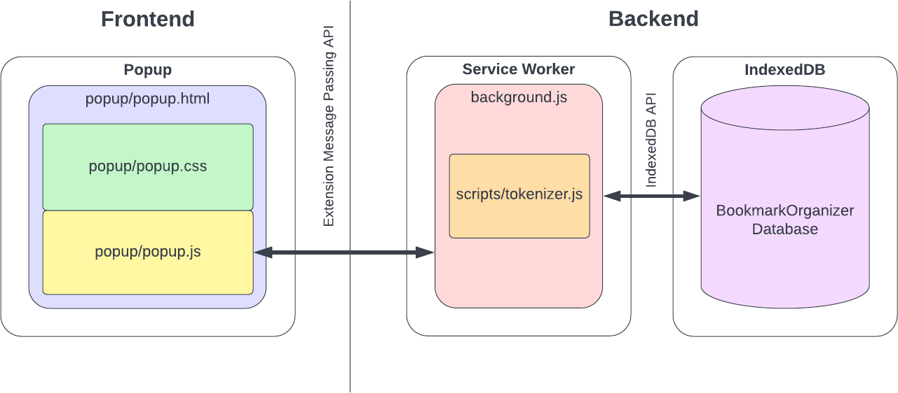
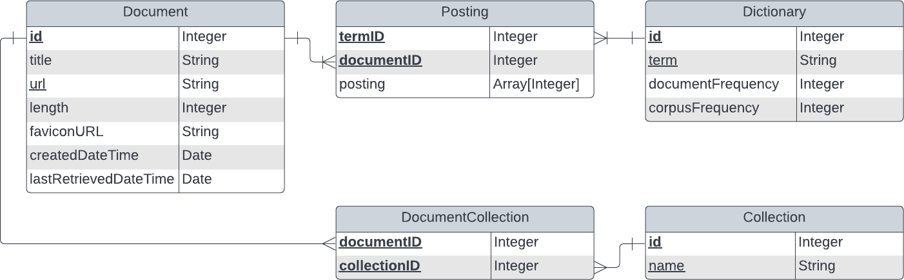
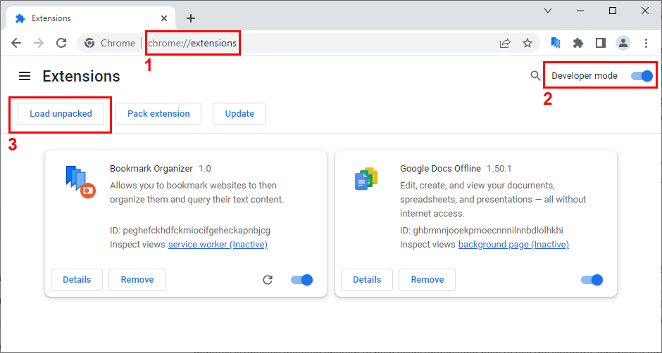

# Documentation

## Table of Contents

1. Software Purpose and Functionality Overview
   1. Purpose
   2. Managing Bookmarks
   3. Managing Collections
   4. Querying
2. Software Implementation
   1. Implementation Overview
   2. Component Organization
   3. Frontend
   4. Backend
3. Software Installation and Use
   1. Installation
   2. Use
4. Credit and Contribution

## 1. Software Purpose and Functionality Overview

### 1.1. Purpose
This Google Chrome extension is designed as a productivity enhacement tool which allows users to bookmark web pages, optionally assign these bookmarks to multiple user-defined collections, and perform a full-text search over these bookmarked web pages' content which is indexed within the user's browser client. This functionality allows users to immediately recall web pages of personal interest by the pages' content rather then having to rely on limited, browser-provided bookmarking functionality which requires memorization and self-devised naming and hierarchy schemes for recall.

### 1.2. Managing Bookmarks
The user interacts with the software throughout the course of normal web browsing. As the user encounters web pages of interest, the user may open the extension's popup from the Chrome toolbar and click a button to add the currently viewed web page to their list of bookmarks. Doing so extracts the text content of the web page and stores it into an inverted index. The user may freely delete previously bookmarked pages from within the extensions popup which removes the pages' content from the index.

### 1.3. Managing Collections
Collections provide the ability for users to group bookmarks so that a subset of bookmarks may be queried. Collections are named groups with which bookmarks may be associated. A bookmark may belong to zero or more collections. Deleting a collection does not delete its associated bookmarks - only the collection itself.

### 1.4. Querying
At any time, the user may submit a text query which performs text retrieval on the index to produce a ranked list of results. The query may be further constrained by two optional filtering criteria:
- Top-n result limit
- Return only results belonging to a specified subset of collections

## 2. Software Implementation

### 2.1. Implementation Overview
The software is implemented in the form of a Google Chrome Manifest V3 extension. As such, JavaScript is the programming language for both the frontend interactive components and backend data processing components. HTML and CSS are used for the user interface elements. Chrome's built-in implementation of the Indexed Database API (IndexedDB) is used as the application's storage system. The extension was built and tested on Google Chrome version 108 running on the Windows 10 operating system.

### 2.2. Component Organization
The software consists of the frontend user interface component and the backend service worker data processing and IndexedDB storage components. In Chrome extension terms, the frontend consists of the popup, and the backend consists of the service worker (often called a "background script" as a legacy term). The frontend engages in bidirectional communication with the backend using the Chrome extension message passing API. A visualization of the component organization is provided below. The implementation of each component and the APIs by which they communicate is described in the following sections.



### 2.3. Frontend
The frontend provides the software's user interface component through which the user issues actionable commands to be executed on the data maintained by the software and displays the outcome of these actions.

#### 2.3.1. Popup
The popup is a small window which displays when the extension's icon is clicked from within the Chrome toolbar. The popup is the user interface with which the user interacts to control the software. Note that an extension popup is not persistent; it is fully reloaded every time it is opened. The popup is implemented as an HTML page, with an associated CSS stylesheet for visual elements. The HTML page also includes a JavaScript file, popup.js, which performs visual manipulation and feedback within the user interface and communicates with the backend using the Chrome extension message passing API. These files are described below.

##### popup/popup.html
popup.html contains the basic HTML structural of the user interface. After the DOM has been loaded, popup.js is invoked to populate the structure with data and functional elements and to add event listeners to interactive elements. This file uses CSS rules from popup.css to style its visual elements.

##### popup/popup.css
popup.css contains the CSS rules used by popup.html.

##### popup/popup.js
popup.js contains the JavaScript used by popup.html to add interactivity to the popup user interface and to make data requests to the backend based upon the user's interactions with the popup. These scripts communicate with the backend using Chrome's extension message passing API, passing JSON request parameters to the backend and receiving JSON response data in return (see the service worker for more detail on this functionality).

### 2.4 Backend
The backend provides the software's data processing and storage functionality; it services requests from the frontend and returns the requested data or outcome of the requested action. The service worker component performs data processing tasks, and the IndexedDB component performs data storage tasks.

#### 2.4.1. Service Worker
The service worker (often called a "background script" as a legacy term carried over from previous versions of Chrome extensions) provides long-running background functionality. Unlike the popup which terminates immediately when it is closed, the service worker executes in the background until the completion of its task. The service worker's script is implemented in the file named background.js. This script imports an additional file, tokenizer.js, which contains a tokenizer class that can be instantiated with customized tokenization functionality. These files are described below.

##### background.js
background.js is the functional component of the software. This script receives JSON requests from frontend via the Chrome extension message massing API, processes the request, and stores and/or retrieves data from the database. The script returns a JSON response to the frontend after each request has been processed.

The general format of a request object is:
```
{
   action: "actionName",
   request-specific-parameter: data
}
```
- `action` is a string containing the requested action (see listing in the background.js)
- `request-specific-parameter` containins data specific to the requested action, e.g., a requested set of document IDs to retrieve

The general format of a response object is:
```
{
   action: "actionName",
   success: true|false,
   reason: Object,
   response-specific-parameter: data
}
```
- `action` is a string containing the originally requested action
- `success` is a boolean value containing "true" if the operation completed successfully or "false" if the operation failed
- `reason` is an Object containing the thrown exception by the operation's failure and is present only if the operation failed
- `response-specific-parameter` contains the response data, e.g., a document listing

This script imports tokenizer.js, which it uses to tokenize document text into the inverted index as well as query text with which to perform text retrieval.

Documents are stored to the inverted index one at a time as the user manually adds them throughout the course of web browsing. At any time, the use may also remove documents from the index. This scripts manages the inverted index stored by the IndexedDB component by appropriately adding, removing, and updating terms and their reference counts in the index's dictionary and postings table.

Document retrieval is performed using term-at-a-time ranking with Okapi BM25 as the scoring function with parameter values $b=0.75, k=1.2$. These typical parameters values were found to perform quite well during testing. Additionally, if the user is searching a specific set of collections, results belonging to more than one of the specified collections are rewarded with a score multiplier of $1 + log_{10}(1 + \frac{c(d, col_{specified}) - 1}{5})$ where $c(d, col_{specified})$ is the count of specified collections to which the document belongs. This gives results which belongs to 2 specified collections an ~8% boost, a ~15% boost for 3 collections, a ~20% boost for 4 collections, etc. This multiplier is awarded as I believe that when a document belongs to multiple collections as filtering criteria specified by the user, then that document is likely to be more relevant and should receive an additional, modest reward.

Query results are returned in descending order of their final score. Each result is displayed with its result set relevance percentage. This is a value equal to $\frac{score_{d}}{score_{max}}$ where $score_{d}$ is the score of a given document in the result set and $score_{max}$ is the score of the highest-scoring document in the result set. This value serves as a helpful indicator of the relative relevence of each result within the set. For example, if a query returns 4 documents, of which the first two are highly relevant and last two are only marginally relevant, it is helpful to see that the first two documents a relative relevance of 100% and 97%, respectively, and that the last two documents have a relative relevance of 45% and 42%, respectively. In this case, the user may choose to save time by ignoring the two lesser relevant documents.

##### scripts/tokenizer.js
tokenizer.js contains a class for a customizable string tokenizer. It provides three points of user-specified customization:
- `formatter` is an optional user-specified function which performs user-specified formatting (e.g., character replacement or removal) on an input string and returns a formatted string
- `tokenizer` is a required user-specified function which splits an input string into an array of tokens; it is expected that this function does not deduplicate the tokens and maintains the order in which they appeared in the original string
- `stopwords` is an optional user-specified array of tokens which are removed from the tokenized string array (i.e., stopword removal)

This file provides a default formatter, tokenizer, and stopwords that can be used out-of-the-box for effective general English text word tokenization.

#### 2.4.2. IndexedDB
IndexedDB is a JavaScript standard NoSQL database provided by most modern browsers, including Google Chrome. Each web domain - or extension - has an isolated IndexedDB instance. The software stores its data in a database named BookmarkOrganizer. An ERD of the database schema is provided below, along with a description of each entity and its fields



##### Document: Metadata for an indexed document (web page)
- `id` (primary key): An auto-incrementing integer ID for the document
- `title`: The title of the web page
- `url` (unique): The URL of the web page with the fragment portion (following a "#") removed if one existed
- `length`: The length of the web page's tokenized text
- `faviconURL`: The URL of the webpage's favicon
- `createdDateTime`: The timestamp that the document was entered into the index
- `lastRetrievedDateTime`: The timestamp that the document was last retrieved (initially, the same as `createdDateTime`; recrawling/updating documents in the index is left as a future enhancement opportunity)

##### Dictionary: The inverted index's term dictionary
- `id` (primary key): An auto-incrementing integer ID for the dictionary
- `term` (unique): The term text
- `documentFrequency`: The number of documents in which the term occurs
- `corpusFrequency`: The number of occurrences of the term throughout the entire corpus

##### Posting: The inverted index's postings table
- `termID`, `documentID` (composite primary key): A The term ID and document ID of this posting
- `posting`: An array of positions locations in the tokenized text at which this token occurs

##### Collection: Named collections
- `id` (primary key): An auto-incrementing integer ID for the collection
- `name` (unique): The name of the collection

##### DocumentCollection: The associations of documents to collections
- `documentID`, `collectionID` (composite primary key): The document ID and collection ID identifying a document-collection relation

## 3. Software Installation and Use

### 3.1. Installation
The software is distributed as an unpacked Chrome extension. The extension was built and tested using Google Chrome version 108. There are no additional dependencies; simply load the extension by following the steps below which are shown in the screenshot where applicable.



1. In a new Chrome tab, navigate to the URL: `chrome://extensions`
2. Enable developer mode if it is disabled
3. Click the "Load unpacked" button
4. Navigate the the location at which you have cloned the repository, and select the `/extension` folder in the root of the repository to load the extension
5. Recommended: pin the extension to the Chrome toolbar for ease of use

### 3.2. Use
This section provides a brief tutorial on how to use the software.

#### 3.2.1. Adding a Web Pages Bookmarks
To add a web page bookmark:
1. Navigate to a web page of interest
2. Open the extension popup by clicking on its icon in the Chrome toolbar
3. Click the "💾 Add This Page" button to add the page to the index

#### 3.2.2. Removing a Web Page Bookmark
1. Open the extension popup by clicking on its icon in the Chrome toolbar
2. Locate the bookmark in the bookmarks list and click the "❌" button beside it
   - Alternatively, if you are currently viewing the same page that you would like to remove, the "💾 Add This Page" will now say "❌ Remove This Page", and may be clicked to remove the bookmark to the same effect

#### 3.2.3. Creating a Collection
1. Open the extension popup by clicking on its icon in the Chrome toolbar
2. Click the "Collections" tab in the popup
3. Click the "➕ Create Collection" button and enter a unique name for the new collection

#### 3.2.4. Renaming or Deleting a Collection
1. Open the extension popup by clicking on its icon in the Chrome toolbar
2. Click the "Collections" tab in the popup
3. Locate the collection in the collection list and click the "✏️" button beside it to rename the collection or the "❌" to delete the collection

#### 3.2.5. Associating a Bookmark with Collections
1. Open the extension popup by clicking on its icon in the Chrome toolbar
2. Locate the bookmark in the bookmarks list and click the "📚" button beside it
3. Use the checkbox to set the bookmark's collection membership, then click "Save & Close" to save your choices and close the selection box or click "Cancel" to close without saving

#### 3.2.6 Querying/Searching
1. Open the extension popup by clicking on its icon in the Chrome toolbar
2. Click the "Search" tab
3. Enter your query terms into the text box
4. Optionally select a different result limit from the "Show top-n" dropdown
5. Optionally set a collections filter by clicking the "Choose Collections..." button, choosing a set of collections to inclusively filter, and clicking "Apply & Close"
6. Click "Search"
   - Alternatively, press the `return` key on the keyboard with the text box in focus

## 4. Credit and Contribution

### Steve McHeny (Captain)
- Project concept, design, implementation, and testing

### Google
- Google Chrome browser (Rendering engine, JavaScript engine, IndexedDB implementation)
- Google Chrome Extension Manifest V3 API

### Ranks NL
- [Default English stopwords list](https://www.ranks.nl/stopwords)