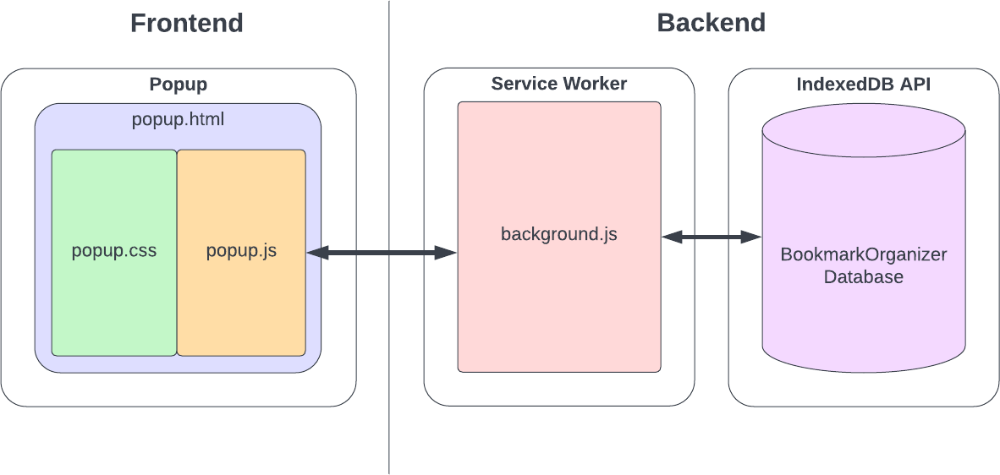

# Documentation

## Table of Contents

1. Software Purpose and Functionality Overview
   1. Purpose
   2. Managing Bookmarks
   3. Managing Collections
   4. Querying
2. Software Implementation
   1. Implementation Overview
3. Software Installation and Use
4. Credit and Contribution

## 1. Software Purpose and Functionality Overview

### 1.1. Purpose
This Google Chrome extension is designed as a productivity enhacement tool which allows users to bookmark web pages, optionally assign these bookmark to zero user-defined collections, and perform a full-text search over these bookmarked web pages' content which is indexed within the user's browser client. This functionality allows users to immediately recall web pages of personal interest by the pages' content rather then having to rely on limited, browser-provided bookmark functionality which requires memorization and self-devised naming and hierarchy schemes for recall.

### 1.2. Managing Bookmarks
The user interacts with the software throughout the course of normal web browsing. As the user encounters web pages of interest, the user may open the extension's popup from the Chrome toolbar to add the currently viewed web page to their list of bookmarks. Doing so extracts the text content of the web page and stores it into an index. The user may freely delete previously bookmarked pages from within the extensions popup which removes the pages' content from the index.

### 1.3. Managing Collections
Collections provide the ability for users to group bookmarks so that the user can query subsets of bookmarks. Collections are named groups with which bookmarks may be associated. A bookmark may belong to zero or more collections. Deleting a collection does not delete its associated bookmarks.

### 1.4. Querying
At any time, the user may submit a text query which performs text retrieval on the index to produce a ranked list of results. The query may be further constrained by two optional filtering criteria:
- Top-n result limit,
- Return only results belonging to a specified subset of collections.

## 2. Software Implementation

### 2.1. Implementation Overview
The software is implemented in the form of a Google Chrome Manifest V3 extension. As such, JavaScript is the programming language for both the frontend interactive components and backend processing components. HTML and CSS are used for the user interface elements. Chrome's built-in implementation of the Indexed Database API (IndexedDB) is used as the application's storage system. The extension was built and tested on Google Chrome version 108 running on Windows 10.

### 2.2. Component Organization
The software consists of the frontend user interface component and the backend service worker data processing and IndexedDB storage components. In Chrome extension terms, the frontend consists of the popup, and the backend consists as the service worker (often called a "background script" as a legacy term). The frontend engages in bidirectional communication with the backend using the Chrome extension message passing API. A visualization of the component organization is provided below. The implementation of each component and the APIs by which they communicate is described in the following sections.



### 2.3. Frontend
The frontend provides the software's user interface component through which the user issues actionable commands to be executed on the data maintained by the software and displays the outcome of these actions.

#### 2.3.1. Popup
The popup is a small window that is displayed when the extension's icon is clicked from within the Chrome toolbar. The popup is the user interface with which the user interacts to control the software. Note that an extension popup is not persistent; it is fully reloaded every time it is opened. The popup is implemented as an HTML page, with an associated CSS stylesheet for visual elements. The HTML page also includes a JavaScript file, popup.js, that handles visual manipulation and feedback within the user interface and communicates with the backend using the Chrome extension message passing API. These files are described below.

##### popup/popup.html
popup.html contains the basic HTML structural of the user interface. After the DOM has been loaded, popup.js is invoked to populate the structure with data and functionality elements and to add event listeners. This file uses CSS rules from popup.css to style its visual elements.

##### popup/popup.css
popup.css contains the CSS rules used by popup.html.

##### popup/popup.js
popup.js contains the JavaScript used by popup.html to add interactivity to the popup user interface and to make data requests to the backend based upon the user's interactions with the popup. These scripts communicate with the backend using Chrome's extension message passing API, passing JSON request parameters to the backend and receiving JSON response data in return (see the service worker for more detail on this functionality).

### 2.4 Backend
The backend provides the software's data processing and storage functionality; it services requests from the frontend and returns the requested data or outcome of the requested action. The service worker component performs data processing tasks, and the IndexedDB component performs data storage tasks.

#### 2.4.1. Service Worker
The service worker (often called a "background script" as a legacy term carried over from previous versions of Chrome extensions) provides long-running background functionality. Unlike the popup which terminates immediately when it is closed, the service worker executes in the background until the completion of its task. The service worker's script is implemented in the file named background.js. This file imports another file, tokenizer.js, which contains a class that can be instantiated with customized tokenization functionality. These files are described below.

##### background.js
background.js is the functional component of the software. It receives JSON requests from frontend via the Chrome extension message massing API, processes the request, and stores and/or retrieves data from the database. The script returns a JSON response to the frontend after each request has been processed. The general format of a request object is:
```
{
   action: "actionName",
   request-specific-parameter: data
}
```
- `action` is a string containing the requested action (see listing in the background.js)
- `request-specific-parameter` containins data specific to the requested action, e.g., a requested set of document IDs to retrieve

The general format of a response object is:
```
{
   action: "actionName",
   success: true|false,
   reason: Object,
   response-specific-parameter: data
}
```
- `action` is a string containing the originally requested action
- `success` is a boolean value containing "true" if the operation completed successfully or "false" if the operation failed
- `reason` is an Object containing the thrown exception by the operation's failure and is present only if the operation failed
- `response-specific-parameter` contains the response data, e.g., a document listing

##### scripts/tokenizer.js


#### 2.4.2. IndexedDB
IndexedDB is a JavaScript standard NoSQL database provided by most modern browsers, including Google Chrome. Each web domain - or extension - has an isolated IndexedDB instance. The software stores its data in a database named BookmarkOrganizer.